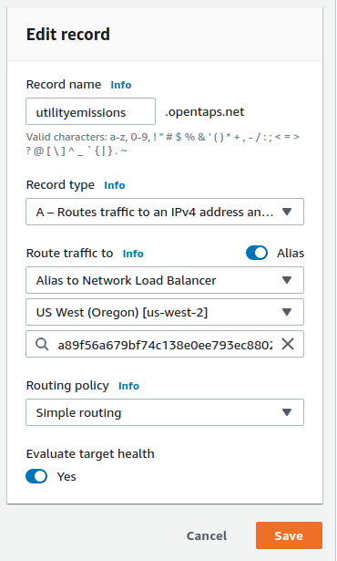

# aws-kubernetes

Deploy emissions-data app to aws kubernetes

## Create api application Docker image

Make sure you have created config files from examples in the typescript_app/src/config directory.

* Set all variables to the null in the networkConfig.ts (They all will be set in the emissions-api-deployment.yaml)
* There is config.ts example for one organisation:
```
export const AUDITORS = {"opentaps":
    {"conConfFile": "/config/connection-opentaps.json",
     "msp": "opentaps",
     "caName": "fabric-ca.opentaps.net",
     "walletPath": "/appdata/wallets/opentaps",
     "isPathAbsolute": true
    },
};

export const ADMIN_USER_ID = null;
export const ADMIN_USER_PASSWD = null;

export const CHAINCODE_NAME = "emissions"
export const CHANNEL_NAME = "emissions-data"
```

* Set S3_LOCAL = false and S3 BUCKET_NAME in the aws-config.js, access keys should be null and be set in the emissions-api-deployment.yaml

Run build from emissions-data directory

    $ docker build -t krybalko/emissions-api:0.0.1 -f aws-kubernetes/Dockerfile .
    $ docker image push krybalko/emissions-api:0.0.1

## Deploy api application Docker image to kubernetes cluster

Create connection config json

    $ cd emissions-data/aws-kubernetes/ccp-generate
    $ ./ccp-generate.sh

Create ConfigMap from connection config json

    $ cd emissions-data/aws-kubernetes
    $ kubectl create configmap emissions-api-config --from-file=./ccp-generate/connection-opentaps.json -n fabric-production

Create ebs volume to store users wallets

    $ aws ec2 --region us-west-2 create-volume --availability-zone us-west-2c --size 5

* Update PersistentVolume at emissions-api-deployment.yaml with volumeID of created ebs
* Set container env: parameters in the emissions-api-deployment.yaml
* Set aws ssl cert arn in to the service.beta.kubernetes.io/aws-load-balancer-ssl-cert in the emissions-api-service.yaml
* If you want to restrict access to the service by IP set loadBalancerSourceRanges: in the emissions-api-service.yaml

Deploy api application

    $ kubectl apply -f ./emissions-api-deployment.yaml -n fabric-production
    $ kubectl apply -f ./emissions-api-service.yaml -n fabric-production

Check both pod and service are running

    $ kubectl get pods -n fabric-production

You should see line like
```
NAME                                         READY   STATUS    RESTARTS   AGE
emissions-api-d5dcf8865-xxxxx         1/1     Running   0          5m
```

    $  kubectl get service -n fabric-production

You should see line like
```
NAME                         TYPE           CLUSTER-IP       EXTERNAL-IP                         PORT(S)                      AGE
emissions-api         LoadBalancer   10.100.32.136    xxxxx.elb.us-west-2.amazonaws.com   80:32667/TCP,443:31641/TCP   5m
```


## Set domain name

Create subdomains on Route 53 for api application, for example emissions.opentaps.net and define simple record similar to example



