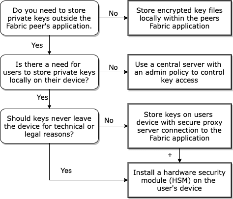

# Secure Identities
This directory provides packages used to secure client key files and setup credential types for signing blockchain transactions. The [utility-emissions-channel](../utility-emissions-channel) blockchain currently support two types of identity credential types used by the fabric network:
* cloud-based keystore based on Hashicorp's Vault to securely access secrets.
* keys stored on the user’s external device using a secure (e.g., web-socket) connection.

## Cloud based identity service vs. external keystore

The above figure outlines decision points when designing secure identity types for users of a Fabric application. The first decision is the most basic (store keys locally). Typically, a Fabric SDK will support key files stored directly on the peer's server. Identity files are stored as standard X.509 certificates containing an encrypted PKCS#8 key file and require no external identity management services.

Key files may also be stored separate from the identity credentials outside the Fabric peer on an external database. This option requires custom signing credential types. Two examples are:
1. Private keys and certificates are stored in a cloud-based storage service (e.g., Hashicorp Vault) operated by an organization.
2. Private keys are stored on the user's external device disconnected from the internet unless otherwise requested by the user.

In the 1st approach an admin policy governs access to client key files on the central server. Key owners can issue and authenticate API tokens to applications (e.g., utility-emissions) so it can use the user's identity credentials.

A Vault-X.509 identity credential type is provided by the utility-emissions-channel. When a Vault-X.509 Identity connection is closed, private keys still reside in the Vault server. The user controls the private key (based on the key policy) but does not have physical ownership.

- Major advantage of the 1st approach: clients are not responsible for communicating with fabric network. A single application is used to manage identities of multiple users.
- Major disadvantage of the 1st approach: all private keys are stored in single database which leads to money pot for hackers to exploit/corrupt

The 2nd option differs in those key files are controlled and physically owned by the user, not a third-party app. 

- Major advantage of the 2nd approach: client's private key is never exposed or stored on the organization's application.
- Major disadvantage in 2nd approach: clients are responsible for communicating with the fabric network and managing their own private keys.

Choosing one over the other depends on whether the organization needs align with centralized identity services versus self-management and physical ownership of key files by its users.

While the 1st option may be suitable for many cases, the 2nd option ensures decentralized ownership better suited to certain conditions:

- Users demand full ownership of key files

- Strict key access constraints

    * Security protocols set by a company or government require actual keys (not just the passwords that encrypt them) to be owned by the identity holder.
    * Physical ownership may be required by law.

- Key file physically locked within an external device.
    
    Physical IoT devices may be enrolled with a network with private keys contained within a Hardware Security Module (HSM) that cannot be extracted and stored by a third party. A WS-X.509 identity credential uses a secure web-socket based proxy to connection to the device.

*Note: other proxy connections/credential types could be used. E.g., gRPC-X.509*

## Connecting external privates keys over web-socket

In the [utility-emissions-channel](../utility-emissions-channel) a secure web-socket server connects the fabric application and a user’s external key file.
A [WS-X.509 credential type for signing fabric transactions] (https://github.com/hyperledger/cactus/pull/1333) has been setup within the cactus connector for Fabric. 

Two packages are required for this connection:

* [ws-identity](./ws-identity/README.MD): server to setup and authenticate the web-socket connections

* [ws-wallet](./ws-wallet/README.md): generate the user's offline private key and open connection to the Fabric peer

The ws-identity server can either be hosted within the Fabric application or as a standalone endpoint linking a Fabric peer and ws-wallet instance.

The server does not store and never sees the user’s private key. It delivers request to sign various payloads, such as:
- a Certificate Signing Request (CSR) used to construct the WS-X.509 identity file when enrolling with the Fabric application. 
- a query or commit transactions to the Fabric network.

[ws-identity-client](./ws-identity-client/README.md) is used to setup the backend connection between ws-identity or ws-wallet and the fabric network.

### Use cases for external private keys

In the utility-emissions-channel the ws-wallet is used on a device owned by an auditor. It verifies emissions data used by the [net-emissions-token-network](../net-emissions-token-network), acting like a notary stamp to verify digital documents.

The ws-wallet could also be used by a physical device, such as a CO2 sensor or other measurement tool that relays information about emissions to the Fabric network. Such a device could be a power plant, a transpiration vehicle, or a mobile remote sensor such as an airplane or satellite. 
